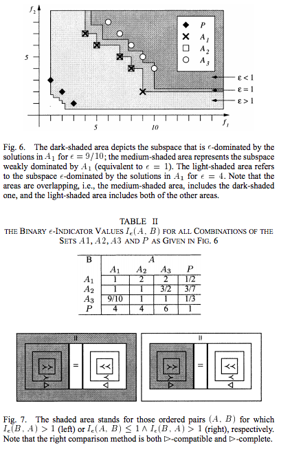
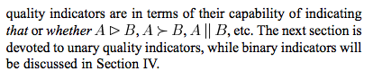

Intro?

the following bla bla bla... performance measures, some introduced by bla bla blah..

=> paper: https://eventos.spc.org.pe/clei2015/pdfs/144491.pdf

# Epsilon

The third most-used metric is epsilon () [2]. Epsilon is a
binary indicator that gives a factor by which an approximation
set is worse than another considering all objectives. Formally,
let A and B be two approximation sets, then (A, B) equals
the minimum factor  such that for any solution in B there is
at least one solution in A that is not worse by a factor of e
considering all objectives [2].

Using Additive Version, first defined in [https://sci2s.ugr.es/sites/default/files/files/Teaching/OtherPostGraduateCourses/MasterEstructuras/bibliografia/Zitzler_Assessment.pdf]

# Spread

=> ∆: This metric is the preferred diversity indicator in
the literature and it was widely used in previous years but
Figure 5 shows that ∆ experimented an important decrease 
in usage in the last years. This diversity indicator diminished
in citations due to the existence of other metrics that provide
more complete information on the quality of solution sets by
considering more than one approximation set (binary metrics)
or by taking into account more than one aspect. Then, the
major drawback of ∆ is that it measures only the diversity of
the approximation set A. Yet, ∆ combined with some other
convergence metrics is still an interesting approach to asses
quality at a low computational cost.

=> With regard to diversity metrics, the spread (∆) was
the most accepted diversity metric. However, in the last
years, the community has not shown interest in measuring
only the diversity of solutions anymore, decreasing the
relevance of this metric. (from paper)

First defined in[https://www.iitk.ac.in/kangal/Deb_NSGA-II.pdf]

# Generational Distance

2) GD: Figure 2 shows the tendency of the second mostused metric: the generational distance. It is interesting to
note that while HV was increasing in use, the opposite
happened with GD. However, the proportion of citations in
2013 improved for GD with respect to the years 2011 and
(specially) 2009. Generational distance presents the advantage
of being lightweight (if compared with the hypervolume, for
example) in terms of computational costs and, combined with
others metrics, can give a very acceptable notion of quality
for an approximation set A. Yet, two main drawbacks can be
identified [11]: i) if there exist an approximation set A with a
large fluctuation in the distance values that are calculated per
generation, the metric may not reveal the true distance; ii) it is
necessary to know the Pareto optimal front or at least a large
number of Pareto optimal solutions.
Although the regression line clearly indicates that this
metric is decreasing in use, GD is still employed in many
studies and hence considerable amount of time shall pass
before researchers desist from using it. (from paper)

(from http://citeseerx.ist.psu.edu/viewdoc/summary?doi=10.1.1.35.8924)

(from http://citeseerx.ist.psu.edu/viewdoc/download?doi=10.1.1.343.9173&rep=rep1&type=pdf)

(from http://citeseerx.ist.psu.edu/viewdoc/download;jsessionid=C3191BEB5B96AC9EC0EF607729546902?doi=10.1.1.35.8924&rep=rep1&type=pdf)
The generational distance used by Van Veldhuizen and Lamont in earlier experiments [148] may be an eective metric gauging MOEA performance. Generational distance is a value representing how \far" P Fknown is from P Ftrue (an
error measure).

First defined in https://apps.dtic.mil/dtic/tr/fulltext/u2/a364478.pdf

# Inverted Generational Distance

IGD: Figure 4 reflects how the inverted generational
distance metric has been used and how its usage tends to
increase in the future. It seems very clear that IGD has gained
more and more attention throughout the years, showing a
total increase of approximately 18% in citations from 2005
to 2013. What makes IGD attractive are basically its low
computational cost and its capability of considering not only
the convergence of an approximation set, but also the diversity
if sufficient optimal solutions are known. The latter feature
may lead to a drawback for this metric when the Pareto
optimal front is unavailable and the reference set contains only
few optimal solutions. This drawback is probable to occur
when dealing with many-objective problems. This difficulty
and some strategies to overcome it are discussed in [63].
Still, IGD represents an excellent alternative in many-objective
problems to other computationally expensive metrics like the
hypervolume. Consequently, the considerable slope of the IGD
regression line and its simplicity compared to HV may suggest
that IGD usage will grow as many-objective problems become
more popular considering the complexity of calculating HV.
(from the paper)

## Drawbacks...

Important! -> https://sci-hub.se/10.1145/2739480.2754792

Recently the inverted generational distance (IGD) has often been
used to evaluate solution sets of many-objective problems [17],
[25]. To the best of our knowledge, the term “inverted
generational distance (IGD)” was first used in 2004 [5], [20].
Similar ideas have been used in the literature since 1998 [6], [9]
where the weighted achievement scalarizing function was used for
distance calculation from each reference point to the nearest
solution. This type of IGD was referred to as D1 in [9] and
denoted as D1R in [9], [16]. However, the Euclidian distance has
been usually used in IGD for performance evaluations in the
literature since 2003 [3], [14]. One advantage of IGD as a
performance indicator over the hypervolume is its computational
efficiency. Since IGD is based on the distance calculation between
two points in the objective space, its calculation is usually very
efficient even in the case of many-objective optimization.
One well-known flaw of the Euclidian distance-based IGD in
comparison with the hypervolume is the lack of the Pareto
compliant property [27], [31]. This flaw is illustrated in Fig. 1
where two solution sets A = {a1, a2, a3}, B = {b1, b2, b3} and a
reference point set Z = {z1, z2, z3} are given in a two-dimensional
objective space. Since every solution in B is dominated by at least
one solution in A, we can say that A is a better solution set than B
from the viewpoint of Pareto dominance. However, the dominated
solution set B is evaluated as being better than A if we use the
Euclidian distance-based IGD in Fig. 1 for comparing A and B.
Another difficulty of IGD is its dependency on the specification of
a reference point set. In Fig. 2, we show another example with two solution sets A, B and a reference point set Z. The solution set
A is evaluated as being better in Fig. 2 by the Euclidian distancebased IGD. In Fig. 3, four reference points z4, z5, z6 and z7 are
added to Z in the example in Fig. 2. After this modification of Z,
the solution set B is evaluated as being better by IGD in Fig. 3
while A is evaluated as being better in Fig. 2. 

(from https://cswww.essex.ac.uk/staff/qzhang/papers/moead.pdf)

(from https://ieeexplore.ieee.org/stamp/stamp.jsp?tp=&arnumber=7007204)

First Defined in (http://citeseerx.ist.psu.edu/viewdoc/download?doi=10.1.1.79.7016&rep=rep1&type=pdf) according to (https://sci-hub.se/10.1145/2739480.2754792), but is part of the same concept as the Generational Distance, so in a sense in the previous definition was the first definition...

# Inverted Generational Distance +

(mostly from https://sci-hub.se/10.1145/2739480.2754792)
- Based on Inverted Generational Distance but with weak Pareto Complaint property
- It’s based on the idea of calculating the distance from each reference point  to the dominated region instead of the distance of the nearest solution
- Can be used also for the single point Decomposed Single-Objective solutions described earlier.

To remedy these difficulties of IGD, a simple modification of the
distance calculation has been proposed in [11]. The proposed idea,
which is explained in Fig. 4 for the solution set A = {a1, a2, a3}, is
to calculate the distance from each reference point zi to the
dominated region by the solution set instead of the distance to the
nearest solution. The modified indicator, which is called IGD+, is the average length of the three dotted lines in Fig. 4. It should be
noted that the two solution sets A, B and the reference point set Z
in Fig. 4 are the same as those in Fig. 1. As we explained in Fig. 1,
the dominated solution set B was evaluated as being better than A
by IGD. Such a Pareto incompliant result is not obtained by IGD+
in Fig. 4 where the solution set A is evaluated as being better than
B. If we use IGD+
 in Fig. 2 and Fig. 3, the solution set A is
evaluated as being better than B. It should be noted that B is
evaluated as being better than A in Fig. 3 by IGD. It was also
shown that IGD+
 is weakly Pareto compliant in [12]. 
Whereas the effect of using IGD+
 instead of IGD is clear in Figs.
1-4, its practical usefulness is still unclear. This is because these
examples were intentionally created for illustration purposes. For
example, the diversities of the two solution sets A and B are
unusually different in each figure. The solution set A has a similar
diversity to the reference point set Z in Fig. 2 whereas B is similar
to Z in the other figures. All examples in [11], [12] are somewhat
similar to these examples in Figs. 1-4 intentionally generated for
illustrating the flaws of IGD. Similar situations to Figs. 1-4 are
not likely to happen frequently in performance comparison of
non-dominated solution sets obtained by EMO algorithms.

Defined as... in https://sci-hub.se/10.1145/2739480.2754792 too

# Hypervolume

(from http://www.optimization-online.org/DB_FILE/2018/10/6887.pdf)

(from http://www.wfg.csse.uwa.edu.au/publications/PhD_thesis_Lucas_Bradstreet.pdf)
### Background 
This chapter presents a review of background material not discussed in the included
papers making up this thesis. The first section introduces multi-objective optimisation and discusses two key areas of research: performance assessment indicators
which are used to compare multi-objective optimiser runs, and selection indicators
which are used during optimisation to choose candidate solutions that drive optimisation toward high quality results. Hypervolume, a popular indicator, can be used
for each of these purposes.
The second part of this chapter examines hypervolume calculation algorithms, with
a primary focus on its use in performance assessment. The final section investigates the calculation and application of hypervolume as a selection indicator within
MOOs.
### Definition 
In a multi-objective optimisation problem, the goal is to find the set of optimal
trade-off solutions known as the Pareto optimal set. Pareto optimality is defined
with respect to the concept of non-domination between points in objective space.
Given two objective vectors x and y, x dominates y iff x is at least as good as y in all objectives, and better in at least one. A vector x is non-dominated with
respect to a set of solutions X iff there is no vector in X that dominates x. X is a
non-dominated set iff all vectors in X are mutually non-dominating. Such a set of
objective vectors is sometimes called a non-dominated front.
A vector x is Pareto optimal iff x is non-dominated with respect to the set of all
possible vectors. Pareto optimal vectors are characterised by the fact that improvement in any one objective means worsening at least one other objective. The Pareto
optimal set or Pareto optimal front is the set of all possible Pareto optimal vectors.
Relations commonly used to compare these vectors include:

Pareto dominance occurs when x is better than y in one objective and equal or
better in the remaining objectives. Under weak Pareto dominance, x is not worse
than y in all objectives. Under these definitions, a set is a Pareto optimal set if
no solutions exist that weakly dominate solutions in the set. Precise definitions of
these terms can be found in [4, 77].
Throughout this thesis, m is used to refer to the size of non-dominated fronts, and
n for the number of dimensions (objectives) in vectors contained in the front

2.3 The Hypervolume Indicator
The hypervolume indicator [60] or S-metric [69] has become widely used in recent years. Hypervolume is the n-dimensional space that is “contained” by an
n-dimensional set of points. When applied to multi-objective optimisation, the ndimensional objective values for solutions can be treated as points. That is, the
hypervolume of a set is the total size of the space dominated by the solutions in the
set (see Figure 1).
Hypervolume encapsulates in a single unary value a measure of the spread of the
solutions along the Pareto front, as well as the distance of the set from the Paretooptimal front. Additionally, it has several favourable mathematical properties. It
was the first unary metric to detect when a set of solutions are not worse than
another set for all solution pairings [77]. Additionally, it is maximised if, and only
if, the set of solutions contains all Pareto optimal points [39].

and labelled with letters. The hypervolume of the set is the volume of the space
covered by points a–d. Figure reproduced from [67].
10 CHAPTER 2. BACKGROUND
The hypervolume of a set is measured relative to a reference point, usually the
anti-optimal point or “worst possible” point for the space. The choice of reference
point is important as it can influence the conclusions resulting from the comparison
of hypervolumes. While still an open problem, one suggestion is to take the worst
known value in each objective and shift it by an appropriate amount [54].

(from https://eventos.spc.org.pe/clei2015/pdfs/144491.pdf)
The hypervolume (HV) [13], also known as S metric,
hyper-area or Lebesgue measure, is an unary metric that
measures the size of the objective space covered by an
approximation set. A reference point must be used to calculate
the mentioned covered space. HV considers all three aspects:
accuracy, diversity and cardinality, being the only unary metric
with this capability. It has been widely accepted since it offers
the following unique and desirable properties [56]: i) whenever
one approximation set completely dominates another approximation set, the hypervolume of the former will be greater than
the hypervolume of the latter. As a consequence, HV is said
to be Pareto compliant; ii) as a result from the just mentioned
property, hypervolume guarantees that any approximation set
A that achieves the maximum possible quality value for a
particular MOP, contains all Pareto optimal solutions. Besides,
a binary version of this metric was proposed in [23] to give HV
the capability of assessing the dominance relationship between
two approximation sets.

### ...

HV: The usage and tendency of Hypervolume is displayed in figure 1. The number of citations in every EMO
edition shows that HV is by far the most accepted metric
in the community. Notice that in 2013 almost 82% of the articles used this metric for experimental purposes, implying
an enormous growth of almost 43% in citations with respect
to 2005. Hence, the regression line for the hypervolume is
ascendant. This means in practical terms the HV will still be
used in the next years at least as much as it has been used until
2013. This indicator gained special attention for the properties
mentioned in Subsection IV-B but it has some biases that must
be considered: first of all, HV requires preference information
for choosing the reference point and even though there is some
freedom to choose this point, that could imply in some cases
information that may not be appropriate in specific situations
[56]. Second, HV may be misleading if the approximation
set A is non-convex. This bias and its possible solution are
covered in detail in [12]. Third, many-objective problems are
gaining attention in the multi-objective optimization field i.e.
multi-objective problems with large number K of objective
functions. The worst-case computational complexity of this
metric is exponential with respect to the number of objective
functions K [60]. In consequence, it becomes unsuitable to
apply HV for many-objective problems. Chan [60], Beume et
al. [61] and Fonseca et al. [62] presented alternatives to deal
with this situation.

(from https://sci2s.ugr.es/sites/default/files/files/Teaching/OtherPostGraduateCourses/MasterEstructuras/bibliografia/Zitzler_Assessment.pdf)

(from http://citeseerx.ist.psu.edu/viewdoc/download?doi=10.1.1.343.9173&rep=rep1&type=pdf)

(from https://sci-hub.se/10.1145/2739480.2754792)
In the EMO community, the hypervolume [29] has been used to
evaluate a set of obtained non-dominated solutions. This is mainly
because no other Pareto compliant unary indicator is known [27],
[31]. The hypervolume has also been used to evaluate the fitness
of each solution in indicator-based EMO algorithms such as SMSEMOA [2] and HypE [1]. High performance of those algorithms
has been reported for many-objective problems [1], [23]. However,
it is not easy to use the hypervolume when the number of
objectives is large (e.g., more than 10) and the number of nondominated solutions is large (e.g., more than 1000). This is
because a long computation time is still needed to calculate the
hypervolume of a large number of non-dominated solutions in a
high-dimensional objective space whereas some fast algorithms
have been proposed for efficient calculation [4], [24], [18]. 

(first defined in https://tik-old.ee.ethz.ch/file//9470d680ed6190147908a1c2fb95b576/ZT1999.pdf)

PISA framework -> https://sop.tik.ee.ethz.ch/publicationListFiles/bltz2003a.pdf

(Dominance) => http://www.wfg.csse.uwa.edu.au/publications/PhD_thesis_Lucas_Bradstreet.pdf

# Friedman Test

Wikipediazo! -> https://en.wikipedia.org/wiki/Friedman_test

(originally from https://www.tandfonline.com/doi/abs/10.1080/01621459.1937.10503522?journalCode=uasa20)
